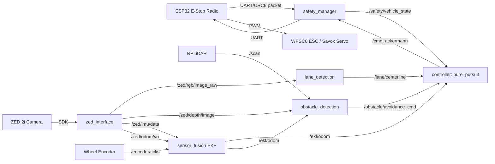

# System Architecture — autonomous_rc

## 1. Node graph (this drop)

`safety_manager` sits electrically and logically between every command-producing
node and the actuators: it is the only package allowed to write to the ESP32
UART link, so it can always force `EMERGENCY_STOP` regardless of what the
planner/controller are doing.

## 2. Topic contract

| Topic | Type | Publisher | Subscriber(s) |
|---|---|---|---|
| `/zed/rgb/image_raw` | `sensor_msgs/Image` | zed_interface | lane_detection |
| `/zed/depth/image` | `sensor_msgs/Image` (32FC1, meters) | zed_interface | obstacle_detection |
| `/zed/depth/points` | `sensor_msgs/PointCloud2` | zed_interface | obstacle_detection (optional) |
| `/zed/imu/data` | `sensor_msgs/Imu` | zed_interface | sensor_fusion |
| `/zed/odom/vo` | `nav_msgs/Odometry` | zed_interface | sensor_fusion |
| `/encoder/ticks` | `std_msgs/Int32` | (encoder_interface, future) | sensor_fusion |
| `/scan` | `sensor_msgs/LaserScan` | (lidar_interface, future) | obstacle_detection |
| `/ekf/odom` | `nav_msgs/Odometry` | sensor_fusion | controller, obstacle_detection |
| `/lane/centerline` | `nav_msgs/Path` | lane_detection | controller |
| `/lane/curvature` | `std_msgs/Float32` | lane_detection | controller (speed profile) |
| `/obstacle/avoidance_cmd` | `geometry_msgs/Twist` (heading bias) | obstacle_detection | controller |
| `/obstacle/costmap` | `nav_msgs/OccupancyGrid` | obstacle_detection | diagnostics/rviz |
| `/safety/estop_status` | `safety_manager/msg/EStopStatus` | safety_manager | all |
| `/safety/vehicle_state` | `safety_manager/msg/VehicleState` | safety_manager | controller |
| `/cmd_ackermann` | `ackermann_msgs/AckermannDriveStamped` | controller | safety_manager |

## 3. ZED 2i feature usage matrix (condensed — see README of `zed_interface`)

| Feature | Enabled in | Why | GPU/CPU cost |
|---|---|---|---|
| Stereo Depth (NEURAL or ULTRA) | Both modes | Ground-truth obstacle range, road-edge cueing | High GPU (NEURAL ~ +25% vs STANDARD) |
| Positional Tracking / VO | Both modes | Drift-corrected odometry input to EKF | Medium GPU |
| IMU | Both modes | High-rate (~400Hz) orientation/yaw-rate for EKF prediction | Negligible (sensor-only) |
| Point Cloud | Obstacle mode only | Richer 3D obstacle clustering than depth image alone | High GPU, high USB bandwidth — **disable in Speed mode** |
| Spatial Mapping / SLAM | Disabled by default | Not needed for a single lap on a known course; costs significant GPU+RAM | High GPU/RAM |
| Object Detection (ZED SDK OD module) | Obstacle mode only, optional | Class-labeled obstacles vs. raw depth clusters | High GPU (competes with TensorRT lane/OD models) |
| Ground Plane Detection | Obstacle mode only | Filters ground returns out of the depth-derived occupancy grid | Low-medium GPU |

Rule of thumb used throughout this codebase: **Speed Race Mode** disables
point cloud, object detection and spatial mapping to maximize framerate and
minimize latency (depth + IMU + VO only). **Obstacle Race Mode** re-enables
point cloud, ground-plane detection and (optionally) object detection.

## 4. Controller comparison (Pure Pursuit vs Stanley vs MPC)

| | Pure Pursuit | Stanley | MPC |
|---|---|---|---|
| Model | Geometric, lookahead arc | Geometric, front-axle heading+cross-track | Kinematic/dynamic bicycle, receding horizon |
| Tuning params | lookahead gain `k`, min/max `Ld` | `k_e` (cross-track gain), `k_soft` | Q/R weights, horizon `N`, dt |
| Cutting corners | Yes (inherent lag at high curvature) | Less (tracks path directly) | Best (optimizes ahead) |
| Compute cost | O(n) nearest-point search | O(n) nearest-point search | Pattern-search over the horizon each cycle — most expensive |
| Racing usage here | **Default (`controller_type: pure_pursuit`)** | Implemented, selectable via `controller_type: stanley` | Implemented, selectable via `controller_type: mpc` |

All three are implemented in the `controller` package behind the shared
`ISteeringController` interface and selected at runtime by the
`controller_type` ROS parameter — no node-wiring changes needed to switch.
MPC here is a derivative-free pattern-search solve against the true
nonlinear bicycle model rather than a linearized QP dispatch, to avoid an
external solver dependency (see `mpc_controller.hpp` for the full
derivation and the tradeoff this implies).

## 5. Obstacle avoidance algorithm comparison (Section F)

| | VFH | DWA | A* (grid) |
|---|---|---|---|
| Complexity | O(sectors) ~ O(1) per cycle | O(v_samples × ω_samples × horizon) | O(E log V) on occupancy grid |
| Latency @ 20Hz LiDAR | Sub-millisecond | Few ms (small horizon) | Depends on grid resolution, can spike |
| Accuracy | Reactive only, no lookahead trajectory | Accounts for kinodynamics | Globally optimal on the grid, but grid is a discretization |
| Best for | High-speed reactive swerve at low compute budget | Tight low-speed maneuvering (recovery) | Global re-planning around static obstacle fields |
| **Chosen here** | **Yes — `obstacle_detection` (command 5)** | Recommended for `recovery_manager` (future) | Recommended for `planner`'s global layer (future) |
DWA is used by
`recovery_manager` for the low-speed `REVERSE`/`RECOVER` states (see that
package's README), and A* remains recommended for `planner`'s future global
layer if a full occupancy grid becomes available (grid updates are far
slower than the 20Hz+ loop low-speed `RECOVER` state and A* for a coarse global path only when a full
occupancy grid is available (grid updates are far slower than the 20Hz+ loop
VFH needs).

## 6. Sensor fusion (EKF) design (Section B)

State vector `x = [x, y, theta, v, omega]ᵀ` (position, heading, body speed, yaw rate).

- **Prediction** (bicycle motion model, dt from wall clock):
  - `x' = x + v cos(theta) dt`
  - `y' = y + v sin(theta) dt`
  - `theta' = theta + omega dt`
  - `v' = v`, `omega' = omega` (random-walk on the last two — corrected by measurements)
  - Process noise `Q = diag(q_x, q_y, q_theta, q_v, q_omega)`, tuned larger on `v/omega`
    since the model does not include acceleration inputs.
- **Measurement 1 — ZED Visual Odometry** (`nav_msgs/Odometry`): `z = [x, y, theta]`,
  `H₁ = [I₃ | 0]`, `R₁` from the VO pose covariance reported by the ZED SDK (scaled
  up when tracking confidence is `SEARCHING`).
- **Measurement 2 — ZED IMU**: `z = [omega]` (gyro-z), `H₂ = [0,0,0,0,1]`,
  `R₂` = gyro noise density from ZED datasheet.
- **Measurement 3 — Wheel encoder**: `z = [v]` from tick-delta/dt, `H₃ = [0,0,0,1,0]`,
  `R₃` tuned from bench-measured encoder jitter; also used to catch VO scale drift.
- Implemented as a sequential (not stacked) EKF: each sensor calls `predict()` then
  `updateX()` at its own arrival rate, which naturally handles the very different
  rates of IMU (~400 Hz), VO (~30–60 Hz) and encoder (~50–100 Hz depending on
  wheel speed) without needing a fixed fusion period.

See `src/sensor_fusion/include/sensor_fusion/ekf.hpp` for the exact matrices.

## 7. Folder status

| Folder | Status |
|---|---|
| `safety_manager` | **Implemented** (this drop) |
| `zed_interface` | **Implemented** (command 2) |
| `lane_detection` | **Implemented** (command 1) |
| `sensor_fusion` | **Implemented** (command 4) |
| `controller` | **Implemented** (command 3; Pure Pursuit, Stanley and MPC, selectable via `controller_type`) |
| `obstacle_detection` | **Implemented** (command 5, VFH) |
| `lidar_interface` | **Implemented** — thin wrapper/config around the vendored `rplidar_ros` driver (blind-spot masking, range clamping) |
| `encoder_interface` | **Implemented** — libgpiod GPIO quadrature tick counter, publishes `/encoder/ticks` and `/encoder/velocity_mps` |
| `planner` | **Implemented** — global racing-line loader + local/global arbitration layer above `obstacle_detection`; not wired into the default `controller` input by default, see its README |
| `recovery_manager` | **Implemented** — DWA-based low-speed recovery motion, exclusively driven by `safety_manager`'s `REVERSE`/`RECOVER` states |
| `diagnostics` | **Implemented** — topic-staleness watchdog + Jetson GPU/CPU health on `/diagnostics`, rosbag recording and GPU profiling scripts |
