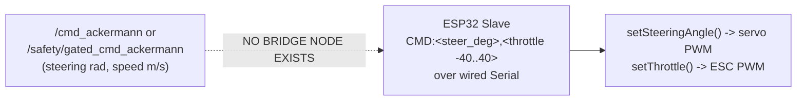
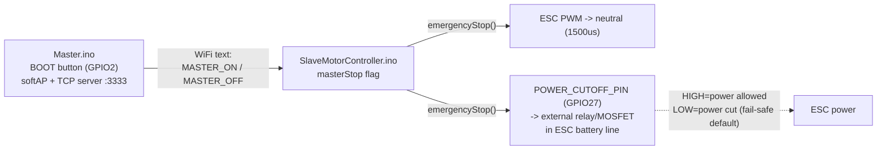

# System Flow — Complete Inputs, Outputs, and Data Path

This describes the full, current signal path for the car: physical sensors →
ROS2 perception/fusion/safety/planning/control → actuation command → ESP32 →
motors, plus the independent E-Stop hardware path. It reflects the codebase
as of this session, including gaps that are not yet built (clearly marked).

## Vehicle physical reference data (measured)

| Property | Value |
|---|---|
| Body dimensions (L×W×H) | 530 × 273 × 190–202 mm |
| Ground clearance | 4 cm |
| Wheelbase | 4.5 cm |
| Max steering deviation | 1.3 cm → max steering angle = atan(1.3/4.5) = **16.1° (0.2812 rad)** |
| Min turning radius | wheelbase²/deviation = **15.6 cm** |
| Camera + LiDAR mount height | 19–20 cm above ground |
| Target course path width | 36 in (0.9144 m) |

---

## 1. Sensor inputs (hardware → ROS2)

| Sensor | Node | Topics published | Rate |
|---|---|---|---|
| ZED 2i camera (RGB) | `zed_interface` | `/zed/rgb/image_raw` | ~15–60Hz |
| ZED 2i camera (depth) | `zed_interface` | `/zed/depth/image` | matches RGB |
| ZED 2i IMU | `zed_interface` | `/zed/imu/data` | ~100Hz |
| ZED 2i visual odometry | `zed_interface` | `/zed/odom/vo` | ~30Hz |
| RPLiDAR | `lidar_interface` (wraps vendored `rplidar_ros`) | `/scan` (filtered, blind-spot masked) | ~10Hz |
| Wheel encoder (GPIO quadrature) | `encoder_interface` | `/encoder/ticks`, `/encoder/velocity_mps` | continuous |
| ESP32 E-Stop link | `safety_manager` (`estop_bridge_node`) | consumes a binary UART `StatusPacket` (10 bytes, CRC-8) over `/dev/ttyUSB_estop` | ≥10Hz heartbeat |

> **Real ZED wrapper alternative**: if using the official `zed-ros2-wrapper` instead of our own `zed_interface` node, launch with `zed_source:=external` — this remaps `lane_detection`/`obstacle_detection`/`sensor_fusion` to the wrapper's real topics (`/zed2i/zed_node/rgb/color/rect/image`, `/depth/depth_registered`, `/imu/data`, `/odom`) instead of our internal `/zed/...` names. No C++ changes needed, launch-time remapping only.

## 2. Perception layer

| Node | Subscribes | Publishes | Purpose |
|---|---|---|---|
| `lane_detection` | `/zed/rgb/image_raw` | `/lane/centerline` (Path), `/lane/curvature_radius_m` (Float32), `/lane/center_offset_m` (Float32), `/lane/debug_image` (optional) | Threshold → bird's-eye warp → sliding-window polynomial fit → curvature + centerline in vehicle-frame meters |
| `obstacle_detection` | `/scan`, `/zed/depth/image`, `/ekf/odom` | `/obstacle/avoidance_cmd` (Twist: steering bias + speed scale), `/obstacle/costmap` (OccupancyGrid), `/obstacle/wall_detected` (Bool), `/obstacle/cliff_detected` (Bool), `/obstacle/{front,left,right}_clearance_m`, `/obstacle/cliff_distance_m`, `/safety/state_request` (UInt8) | VFH obstacle avoidance + wall detection (sector clearance) + cliff/negative-obstacle detection (ground-plane analysis) |

## 3. Fusion layer

| Node | Subscribes | Publishes | Purpose |
|---|---|---|---|
| `sensor_fusion` (`ekf_node`) | `/zed/odom/vo`, `/zed/imu/data`, `/encoder/velocity_mps` | `/ekf/odom` (Odometry: fused pose + twist) | EKF fusion; degrades gracefully to VO+IMU-only if encoder is absent |

## 4. Planning layer

| Node | Subscribes | Publishes | Purpose |
|---|---|---|---|
| `planner` (`local_planner_node`) | `/ekf/odom`, `/lane/centerline`, `/obstacle/avoidance_cmd` | `/planner/local_path`, `/planner/global_path`, `/safety/state_request` | Loads a pre-surveyed raceline (`config/raceline.yaml` — **currently a 20m-straight placeholder, not this course's real geometry**) and arbitrates it against the live lane centerline (`race_mode: speed` = lane-centerline primary, `race_mode: obstacle` = raceline primary) |

## 5. Safety arbitration layer (the authority all actuation must respect)

| Node | Subscribes | Publishes | Purpose |
|---|---|---|---|
| `safety_manager` (`estop_bridge_node`) | `/safety/state_request` (UInt8: 0=clear,1=AVOID,2=BRAKE,3=REVERSE,4=RECOVER,9=operator_clear), `/cmd_ackermann` | `/safety/vehicle_state` (state machine output), `/safety/estop_status`, `/safety/gated_cmd_ackermann` (defense-in-depth re-gated copy of `/cmd_ackermann`) | Owns the single source of truth for vehicle state. `EMERGENCY_STOP` is entered unconditionally from `estop_pressed` or link-loss and is a **one-way latch** — it only exits via an explicit `operator_clear_requested` (state_request=9), never automatically |

`VehicleState.msg` states: `NORMAL=0, AVOID=1, BRAKE=2, REVERSE=3, RECOVER=4, EMERGENCY_STOP=5`.

## 6. Control layer

| Node | Subscribes | Publishes | Purpose |
|---|---|---|---|
| `controller` (`pure_pursuit_node`) | `/lane/centerline`, `/lane/curvature_radius_m`, `/ekf/odom`, `/safety/vehicle_state`, `/obstacle/avoidance_cmd` | `/cmd_ackermann` (AckermannDriveStamped: `steering_angle` rad, `speed` m/s) | Swappable steering law (`controller_type`: pure_pursuit / stanley / mpc). Computes speed from curvature (`v=sqrt(4.0×R)`) × obstacle speed-scale. Only commands motion in `NORMAL`/`AVOID` states — publishes zero otherwise. Steering slew-rate limited (3.0 rad/s) for skid-free transitions |

## 7. Recovery layer

| Node | Subscribes | Publishes | Purpose |
|---|---|---|---|
| `recovery_manager` | `/safety/vehicle_state`, `/obstacle/costmap`, `/ekf/odom`, `/lane/centerline` | `/cmd_ackermann`, `/safety/state_request` | Exclusively owns `/cmd_ackermann` during `REVERSE`/`RECOVER` (DWA-based back-away + re-align), so it never fights `pure_pursuit_node` for the same topic |

## 8. Actuation output → ESP32 — **this is where a real gap exists**



- Our ROS2 stack computes a correct `/cmd_ackermann` (radians + m/s).
- The real `SlaveMotorController.ino` firmware expects a **completely different** wired-serial text format: `CMD:<steer_degrees>,<throttle_-40..40>\n`.
- **No node in this workspace currently converts one into the other.** This must be built before the ROS2 stack can drive the real motors (convert radians→servo-degree range 45–160, and m/s→the -40..40 throttle units, then write `CMD:...\n` to the Jetson's serial port connected to the ESP32).

## 9. E-Stop hardware path (separate from the motor-command path above)



- **This is a completely separate wireless system** from the ROS2-side `safety_manager`/UART design — two independent boards (Master = e-stop transmitter with physical button, Slave = motor driver), talking over WiFi in plain text, not the binary CRC-8 UART protocol `safety_manager` expects on `/dev/ttyUSB_estop`.
- Fixed this session: `emergencyStop()`/`resumeMotor()` now drive a hardware power-cutoff GPIO (fail-safe: floating/crashed = cut), not just a software PWM-neutral write, since a PWM neutral alone does not guarantee the motor can't be driven (depends on the ESC's own interpretation) and does not guarantee an instant stop (coasting vs. active braking depends on ESC hardware, unverified for this specific ESC).
- Also fixed: WiFi/TCP link loss now triggers the same `emergencyStop()` (previously it silently reconnected with no stop), and `resumeMotor()` no longer reapplies a stale (possibly reverse) throttle value on clear.
- **Not yet done**: the physical relay/MOSFET circuit itself must still be wired to `POWER_CUTOFF_PIN` — the firmware-side control logic is ready but requires the external hardware to actually cut power.

## 10. Full topic map (all ROS2 topics used above)

| Topic | Type | Publisher(s) | Subscriber(s) |
|---|---|---|---|
| `/zed/rgb/image_raw` | Image | `zed_interface` | `lane_detection` |
| `/zed/depth/image` | Image | `zed_interface` | `obstacle_detection` |
| `/zed/imu/data` | Imu | `zed_interface` | `sensor_fusion` |
| `/zed/odom/vo` | Odometry | `zed_interface` | `sensor_fusion` |
| `/scan` | LaserScan | `lidar_interface` | `obstacle_detection` |
| `/encoder/velocity_mps` | Float32 | `encoder_interface` | `sensor_fusion` |
| `/ekf/odom` | Odometry | `sensor_fusion` | `controller`, `obstacle_detection`, `planner`, `recovery_manager` |
| `/lane/centerline` | Path | `lane_detection` | `controller`, `planner`, `recovery_manager` |
| `/lane/curvature_radius_m` | Float32 | `lane_detection` | `controller` |
| `/obstacle/avoidance_cmd` | Twist | `obstacle_detection` | `controller`, `planner` |
| `/obstacle/wall_detected`, `/obstacle/cliff_detected` | Bool | `obstacle_detection` | (diagnostics/monitoring) |
| `/safety/state_request` | UInt8 | `obstacle_detection`, `planner`, `recovery_manager`, `diagnostics/clear_estop.py` | `safety_manager` |
| `/safety/vehicle_state` | VehicleState | `safety_manager` | `controller`, `recovery_manager`, `diagnostics` |
| `/cmd_ackermann` | AckermannDriveStamped | `controller`, `recovery_manager` | `safety_manager` (re-gates), **[missing: ESP32 bridge]** |
| `/safety/gated_cmd_ackermann` | AckermannDriveStamped | `safety_manager` | **[missing: ESP32 bridge]** — intended final safety-checked output |

## 11. Summary: complete flow, sensor to motor

```
ZED camera/depth/IMU/VO ─┐
RPLiDAR scan ────────────┼─► perception (lane_detection, obstacle_detection)
Wheel encoder ───────────┘         │
                                    ▼
                          sensor_fusion (EKF) ──► /ekf/odom
                                    │
                                    ▼
                    planner (raceline arbitration, optional)
                                    │
                                    ▼
               controller (Pure Pursuit/Stanley/MPC) ──► /cmd_ackermann
                                    │
                                    ▼
        safety_manager (state machine + E-Stop gate) ──► /safety/gated_cmd_ackermann
                                    │
                                    ▼
                    [ MISSING: Ackermann → "CMD:steer,throttle" bridge ]
                                    │
                                    ▼
              SlaveMotorController.ino (ESP32) ──► servo + ESC PWM ──► motion

E-Stop (independent path):
  Master.ino button ──WiFi──► SlaveMotorController.ino ──► ESC neutral + power cutoff (GPIO27)
```
